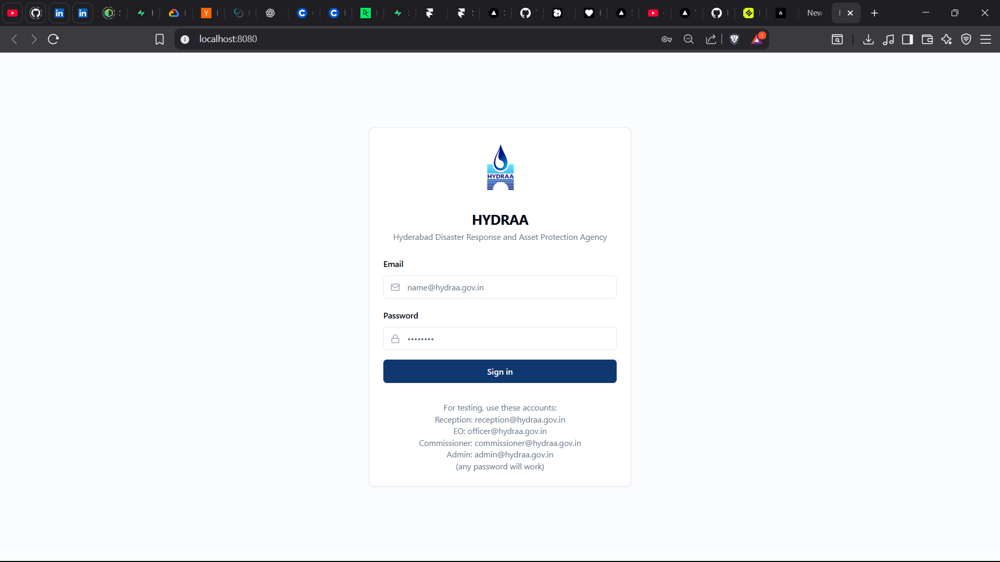
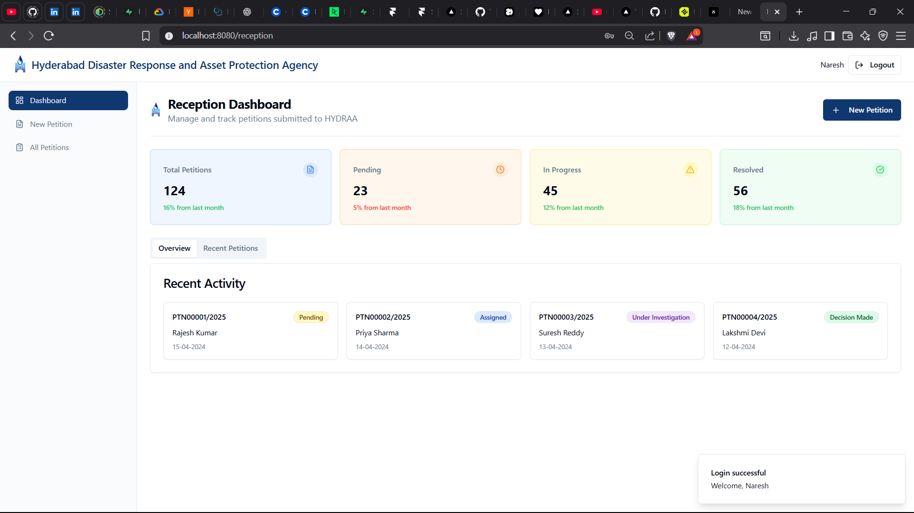
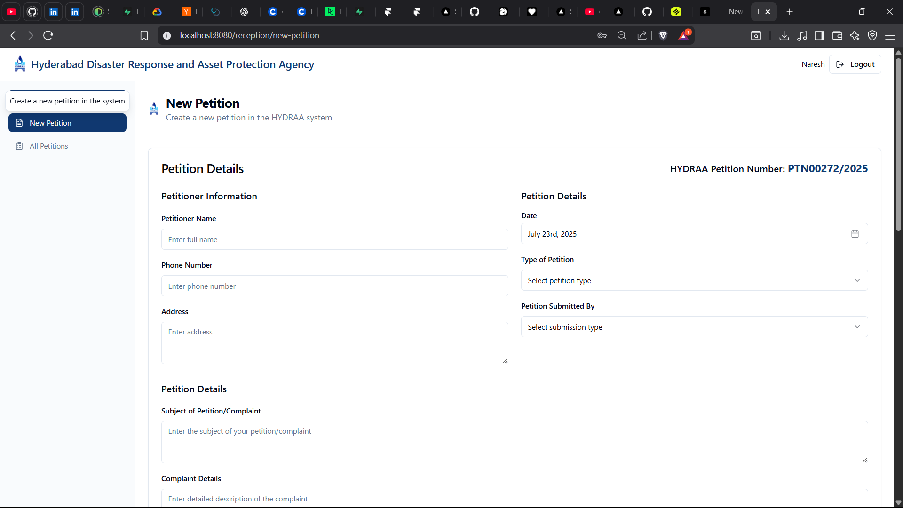
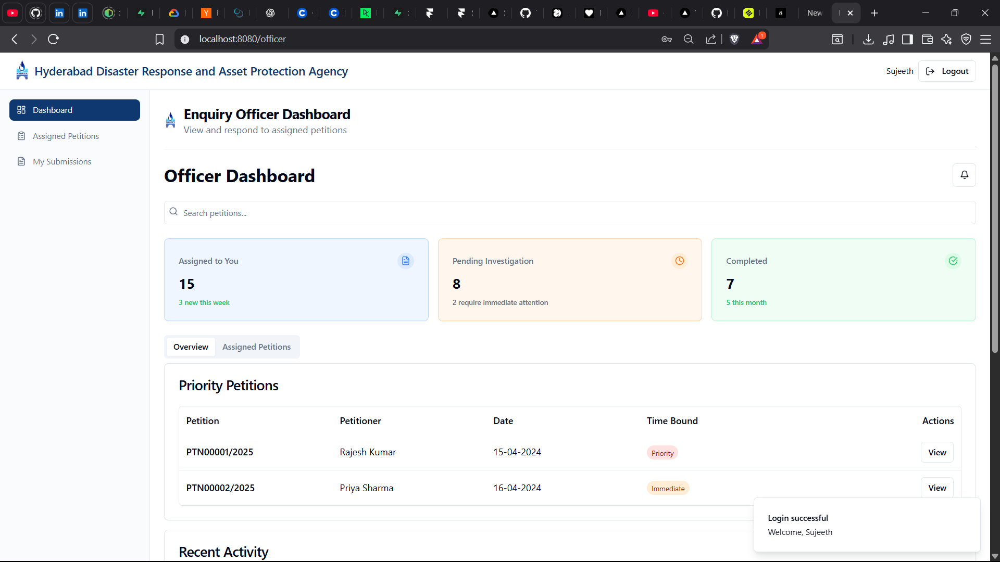
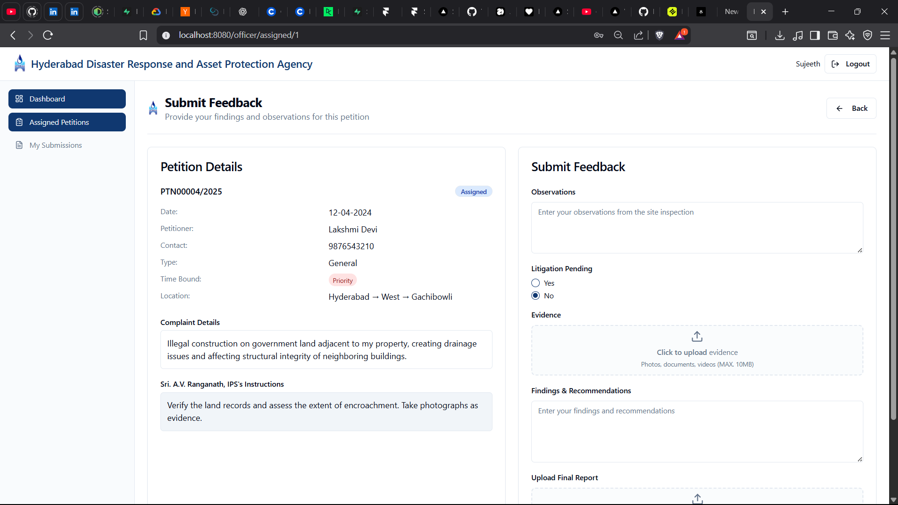
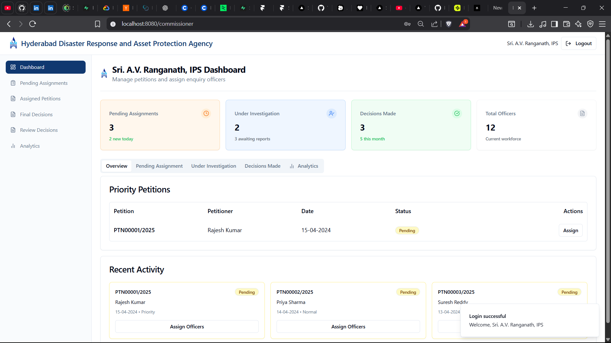
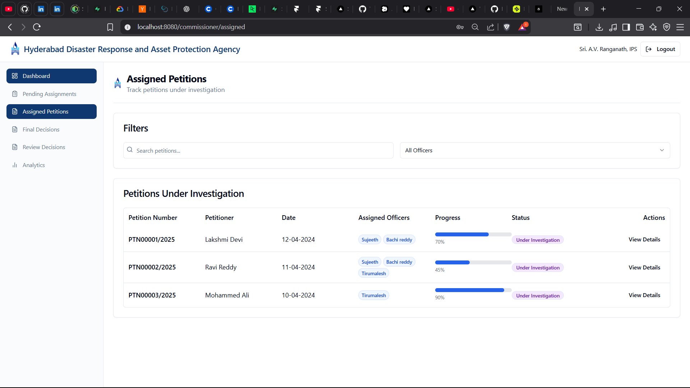
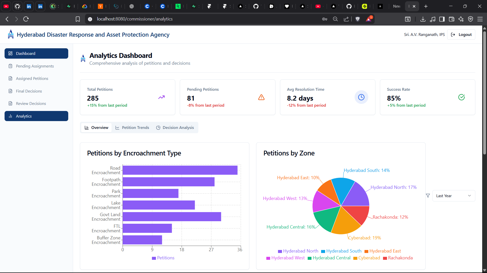
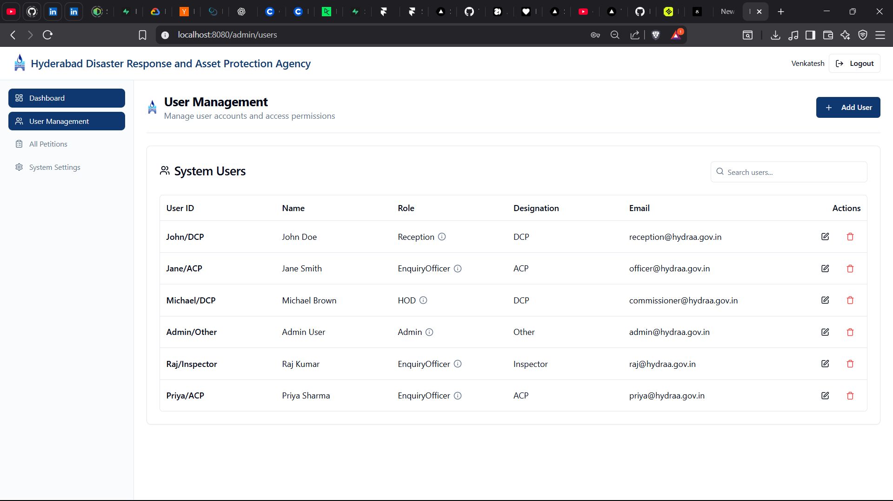

# 🏛️ Hydraa-PMS

<div align="center">


**Manage petitions like a pro! 🚀**

*Comprehensive Petition Management System for Hyderabad Disaster Response and Asset Protection Agency*

</div>

---

## 🎯 What's This?

A **modern, full-featured** web application for managing petitions and complaints within the Hyderabad Disaster Response and Asset Protection Agency (HYDRAA). Think of it as your digital command center for efficient petition processing! 📋

### ✨ What You Get
- 🔐 **Multi-role authentication** (Reception, Officer, Commissioner, Admin)
- 📝 **Streamlined petition creation** and management
- 🎯 **Role-based dashboards** with real-time statistics
- 📊 **Advanced analytics** and reporting
- 🔄 **Workflow automation** from submission to decision
- 📱 **Responsive design** for all devices
- ⚡ **Lightning-fast** performance with Vite

---

## 🖼️ Screenshots

### 🔐 Login Interface

*Secure authentication with role-based access*

### 📊 Reception Dashboard

*Overview of petitions and recent activities*

### 📝 Create New Petition

*Intuitive form for petition submission*

### 👮 Officer Dashboard

*Enquiry officer's workspace with assigned petitions*

### 🔍 Officer Enquiry

*Detailed feedback submission interface*

### 🏛️ Commissioner Dashboard

*High-level overview and decision management*

### 📋 Commissioner Assigned Petitions

*Track petitions under investigation*

### 📈 Commissioner Analytics

*Comprehensive data visualization*

### 👥 User Management

*Admin interface for user management*

---

## 🚀 Quick Start

```bash
# 1. Clone it
git clone https://github.com/jonathanrao99/Hydraa-PMS.git
cd Hydraa-PMS

# 2. Install dependencies
npm install

# 3. Start development server
npm run dev
```

**That's it!** 🎉

---

## 🎮 How to Use

### 🔐 Login Credentials
For testing, use these accounts:
- **Reception**: `reception@hydraa.gov.in` (any password)
- **Enquiry Officer**: `officer@hydraa.gov.in` (any password)
- **Commissioner**: `commissioner@hydraa.gov.in` (any password)
- **Admin**: `admin@hydraa.gov.in` (any password)

### 📋 User Roles & Permissions

#### 🏢 Reception Staff
- Create new petitions
- View all petitions
- Manage petition status
- Dashboard with statistics

#### 🔍 Enquiry Officers
- View assigned petitions
- Submit investigation reports
- Upload evidence and findings
- Track investigation progress

#### 🏛️ Commissioner (HOD)
- Assign petitions to officers
- Review investigation reports
- Make final decisions
- Access analytics dashboard

#### 👨‍💼 Administrator
- Manage user accounts
- System configuration
- View all petitions
- Access system analytics

---

## 🛠️ What's Inside

```
Hydraa-PMS/
├── 📁 src/
│   ├── 📁 components/          # Reusable UI components
│   │   ├── 📁 auth/           # Authentication components
│   │   ├── 📁 common/         # Shared components
│   │   ├── 📁 layout/         # Layout components
│   │   ├── 📁 petition/       # Petition-specific components
│   │   └── 📁 ui/             # Base UI components (shadcn/ui)
│   ├── 📁 contexts/           # React contexts
│   ├── 📁 hooks/              # Custom React hooks
│   ├── 📁 lib/                # Utilities and constants
│   ├── 📁 pages/              # Page components
│   │   ├── 📁 admin/          # Admin pages
│   │   ├── 📁 commissioner/   # Commissioner pages
│   │   ├── 📁 dashboard/      # Dashboard pages
│   │   ├── 📁 officer/        # Officer pages
│   │   └── 📁 reception/      # Reception pages
│   ├── 📁 services/           # API services
│   └── 📁 types/              # TypeScript type definitions
├── 📁 public/                 # Static assets
├── ⚙️ package.json            # Dependencies and scripts
├── 🎨 tailwind.config.ts      # Tailwind configuration
├── ⚡ vite.config.ts          # Vite configuration
└── 📋 README.md               # This file
```

---

## 🛠️ Development

### Available Scripts

```bash
# Development
npm run dev              # Start development server
npm run build            # Build for production
npm run preview          # Preview production build

# Code Quality
npm run lint             # Run ESLint
npm run lint:fix         # Fix ESLint issues
npm run type-check       # TypeScript type checking
npm run format           # Format code with Prettier
npm run format:check     # Check code formatting
```

### Tech Stack

- **Frontend**: React 18 + TypeScript
- **Build Tool**: Vite
- **Styling**: Tailwind CSS + shadcn/ui
- **Routing**: React Router DOM
- **Forms**: React Hook Form + Zod
- **State Management**: React Context + TanStack Query
- **Charts**: Recharts
- **Icons**: Lucide React

---

## 🐛 Troubleshooting

**Problem**: `ModuleNotFoundError: No module named 'react'`
**Solution**: `npm install`

**Problem**: Build fails with TypeScript errors
**Solution**: `npm run type-check` to identify issues

**Problem**: Styling not working
**Solution**: Ensure Tailwind CSS is properly configured

**Problem**: Login not working
**Solution**: Check browser console for errors, ensure all dependencies are installed

---

## 🤝 Contributing

1. **Fork it** 🍴
2. **Create a branch** 🌿
3. **Make changes** ✏️
4. **Submit PR** 🚀

*Ideas welcome!* 💡

---

## ⚠️ Disclaimer

**For demonstration purposes!** This is a prototype application showcasing modern web development practices. In production, implement proper security measures, database integration, and API endpoints.

---

<div align="center">

### 🌟 Star the Repository
If you find this project helpful, please give it a ⭐ on GitHub!

[](https://github.com/jonathanrao99/Hydraa-PMS)

### 📞 Connect & Support
[](https://github.com/jonathanrao99)
[](https://www.linkedin.com/in/jonathanrao99)
[](https://buymeacoffee.com/jonathanthota)

---

**Made with ❤️ and ☕ by Jonathan Thota**

*Managing petitions, one click at a time! 📋*

</div>
